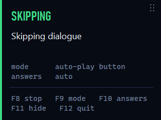

# Genshin Auto-Skip HUD

[](https://github.com/KirillKalmutsky/genshin-auto-skip-hud/actions/workflows/build.yml)

Advances Genshin Impact dialogue for you. Runs in the system tray with an
optional click-through HUD showing what it is doing.



The panel is click-through and never takes focus, so it sits over the game
without getting in the way. `F11` hides it.

> Using third-party software with Genshin Impact violates its Terms of Service.
> This tool never touches the game process — it reads pixels from the screen and
> synthesises keystrokes — but that does not make it sanctioned. Your account,
> your call.

---

## Quick start

Download `GenshinAutoSkipHUD.exe` from [Releases](../../releases) and run it. It
asks for administrator rights on launch — see [Why administrator](#why-administrator).

Windows will probably warn you first. The executable is not code-signed, so
SmartScreen shows *"Windows protected your PC"* — click **More info → Run
anyway**. Some antivirus engines also flag PyInstaller executables that
synthesise keystrokes and request administrator rights; that combination is
exactly what this tool does, so the warning is not surprising. Each release
lists the SHA-256 of its binary if you want to check what you downloaded, and
the source is here to build yourself.

Or build it yourself:

```
build.bat            # puts GenshinAutoSkipHUD.exe in this folder
build.bat --onedir   # exe plus a runtime\ folder; starts faster
```

To run from source instead, `run.bat`.

## Controls

| Key | Action |
| --- | --- |
| `F8` | Start / Stop |
| `F9` | Cycle the detection anchor |
| `F10` | Answer choices automatically, or leave them to you |
| `F11` | Show/hide the HUD |
| `F12` | Exit |

`F10` is the one worth remembering. Leave answering on to blast through filler,
and press it the moment a conversation you care about starts: the skipper keeps
advancing lines but stops at each choice and reads `YOUR TURN`, so a deliberate
stop is never mistaken for a broken tool.

The panel's left edge carries the state as a colour: green working, amber
waiting on the game or on focus, blue your move, red not running.

To move it, grab the dotted handle in its top-right corner and drag; it stays
where you leave it. The handle is the only part of the overlay the mouse can
touch — everything else is click-through, so clicks meant for the game pass
straight through the panel. One place not to put it: over the auto-play button
in the top-left, which is the thing detection reads.

The tray menu covers the same actions plus the interaction key and four speed
presets, from `Fast` at 40–70 ms to `Slow` at 400–600 ms, which is slow enough
to read along with. Every change takes effect immediately; nothing needs a
restart.

## Settings

Everything is set from the tray menu and remembered immediately — there is
nothing to edit and no configuration file to keep track of. Settings live under
`HKEY_CURRENT_USER\Software\GenshinAutoSkip`, so they need no administrator
rights and survive replacing the executable.

| Setting | Default | Meaning |
| --- | --- | --- |
| `confirm_button` | `f` | In-game interaction key |
| `detection_anchor` | `auto` | What to key on: `auto`, `marker` or `both` |
| `auto_answer` | on | Pick dialogue choices too, rather than waiting for you |
| `press_min_ms` / `press_max_ms` | `60` / `110` | Bounds of the randomised press interval |
| `key_hold_ms` | `60` | How long the key stays down |
| `idle_poll_ms` | `100` | How often to look at the screen when nothing is happening |
| `detection_hold_ms` | `0` | Keep pressing this long after detection stops |
| `hud` | on | Show the on-screen panel |
| `hud_position` | `top-right` | Corner it starts in: `top-right`, `bottom-left`, `bottom-right` |
| `hud_x` / `hud_y` | unset | Where the panel was dragged to |
| `hud_opacity` | `1.0` | Lower it if you want the game to show through |
| `spam_mode` | off | Press on a timer, ignoring detection |
| `random_breaks` | off | Occasional 3–8 s idle pauses |
| `profile` | off | Write `loop_profile.csv` for diagnosing press rate |

`key_hold_ms` is the one to leave alone: the game samples input once per frame,
and a shorter hold risks falling between two samples.

To leave nothing behind, delete that registry key — the program writes no files.

## How it works

### Input

Keys go out through `SendInput` with hardware scan codes, held long enough to
span one of the game's input polls.

This is not a stylistic choice. `pyautogui` and similar libraries drive the
keyboard through the legacy `keybd_event` call, and the game ignores those
events entirely — holding the key longer does not help either. Scan codes are
preferred over virtual key codes because they address a physical key, so they
survive a non-Latin keyboard layout.

### Detection

The tool watches the auto-play button in the top-left corner, which the game
draws whenever a dialogue is on screen.

The button is awkward to recognise: it shows a play triangle or pause bars, and
it can be lit or half-transparent — and while it is transparent, the scenery
behind it shows through and changes how it looks. Describing it by appearance
does not work, because "a bright round icon" also matches the quest journal
icon, the back arrow in menus, and the Paimon button.

So instead of describing it, the tool subtracts the background. The button is a
light disc with a dark glyph on it, and the difference between the two depends
only on how transparent the button is — not on what is behind it. Scaling that
difference to a fixed range removes the transparency as well, leaving the plain
shape of the glyph, which is then compared against two reference images: one
triangle, one pair of bars.

That same difference also says how faded the button is, which is how the tool
knows the game is waiting for you to pick an answer.

Regions are anchored to the game window rather than to the screen, and scale
with its height, so other resolutions and ultrawide displays work without
per-resolution tables.

While a dialogue is running the loop sleeps until the next press is due instead
of polling continuously, so it barely touches the CPU. `IDLE_POLL_MS` sets the
only remaining poll — how quickly a new dialogue is noticed.

## Why administrator

Genshin Impact runs elevated. Windows refuses to deliver synthetic input from a
process at a lower integrity level, silently — no error, the keys simply vanish.
The executable therefore carries a UAC manifest, and running from source
elevates through `run.bat`.

## Limitations

- **Only while the game is focused.** `SendInput` always targets the foreground
  window; pressing while alt-tabbed would type into whatever you switched to.
  No supported Windows API sends input to a background window — see
  [The Old New Thing](https://devblogs.microsoft.com/oldnewthing/20250319-00/?p=110979).
  Windows routes input per *desktop*, not per window, so the only real answer is
  a second session, which on Windows client editions needs an unsupported patch.
  Every comparable tool gates on focus for the same reason.
- **Cinematic cutscenes are not handled.** They draw neither the auto-play
  button nor option bubbles. Pressing the key there does nothing anyway.
- **Exclusive fullscreen does not work — use borderless or windowed.** Verified
  in the game: exclusive fullscreen bypasses the desktop compositor, so a screen
  grab returns nothing to look at. Supporting it would mean hooking the game's
  own rendering from inside its process, which this tool does not do.
- **Windows only.**

## Diagnostics

Set `PROFILE=1` to log every loop iteration to `loop_profile.csv`: phase, how
long detection took, the confidence, and the gap since the previous press. That
is the fastest way to tell a detection problem from a timing one.

If a game update ever breaks input entirely, the thing to re-measure is which
injection method the game still accepts — see the table above for what was
measured last time.

## Layout

```
GenshinAutoSkipHUD.exe    the built application
run.bat                   run from source instead
build.bat                 rebuild the executable

src/
    main.py               entry point for the frozen build
    build.py              PyInstaller packaging
    genshin_autoskip/
        app.py            wiring: threads, hotkeys, lifecycle
        loop.py           detection loop and press scheduling
        detection.py      shape recovery and matching
        templates.py      the two reference shapes, embedded
        input_backend.py  SendInput scan-code keyboard
        hud.py            click-through on-screen panel
        tray.py           tray icon and menu
        window.py         foreground and geometry queries
        config.py         .env settings
        icons.py          runtime-generated icons

tests/                    pytest suite
```

There is no way to "just build an exe" without the Python package: an executable
*is* this code bundled together with an interpreter, and PyInstaller is what does
the bundling. Both ship together so the source stays readable.

## License

MIT — see [LICENSE](LICENSE).
